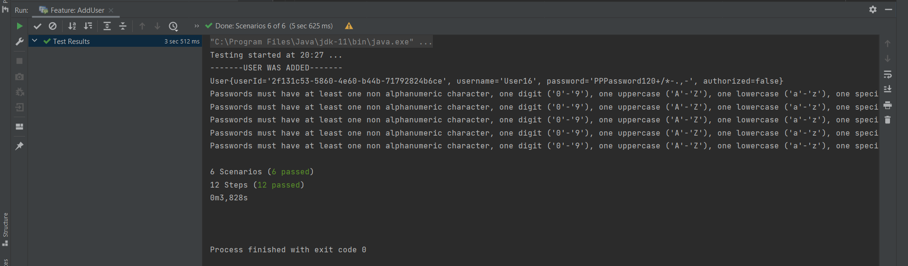

<h1>BOOK STORE API TEST</h1>

<h2>SCENARIOS</h2>

    #The user will be fetched
    Scenario: FetchUser
      When Generate token the user who has "USER_1" username and "PPPassword120+/*-.,-" password
      Then Get the user who has "f5e630d0-d304-45bf-8d6c-b172427fed7e" userid , "USER_1" username and "PPPassword120+/*-.,-" password

    Scenario:AddUserWithPositive
      When The user who has "User16" email and "PPPassword120+/*-.,-" password will be added
      Then Response will be confirmed as 200 code ok

    #The password must be contain at least one digit 0 - 9
    Scenario:AddUserWithNegativeWithoutDigit
      When The user who has "User5" email and "PPPassword+/*-," password will be added
      Then Response will be confirmed as 400 code ok

    #The password must be contain at least one SpecialChar
    Scenario: AddUserWithNegativeWithoutSpecialChar
      When The user who has "User6" email and "PPPassword1230" password will be added
      Then Response will be confirmed as 400 code ok

    #The password must be contain at least one UpperCase
    Scenario: AddUserWithNegativeWithoutUpperCase
      When  The user who has "User7" email and "password123+/*-.," password will be added
      Then  Response will be confirmed as 400 code ok

    #The password must be consist eight characters or longer
    Scenario: AddUserWithNegativeLessThenEightChars
      When The user who has "User8" email and "Pa1+/*" password will be added
      Then Response will be confirmed as 400 code ok

    #The password must be have at least one alphanumeric character
    Scenario: AddUserWithNegativeNonAlphanumericChar
      When The user who has "User9" email and "Password123" password will be added
      Then Response will be confirmed as 400 code ok
  

This is a test automation project for a Book Store API. The project is written in Java and uses HttpRequest/Response Classes, Cucumber, and JUnit.

The Book Store API Testing project aims to automate the testing of a Book Store API. It includes various to ensure the functionality and reliability of the API. The tests are written in Gherkin language using Cucumber, and the assertions are made using HttpRequest/Response classes library. JUnit is used as the test runner.

<h2>TECHNOLOGIES USED</h2>

The following technologies and libraries are used in this project:

<ul>
  <li>Java: Programming language used for writing the tests.</li>
  <li>Cucumber: Framework used for writing BDD-style test scenarios.</li>
  <li>JUnit: Test runner used for executing the tests.</li>
  <li>RestAssured: HttpRequest/Response classes used for making HTTP requests and validating responses.</li>
</ul>

